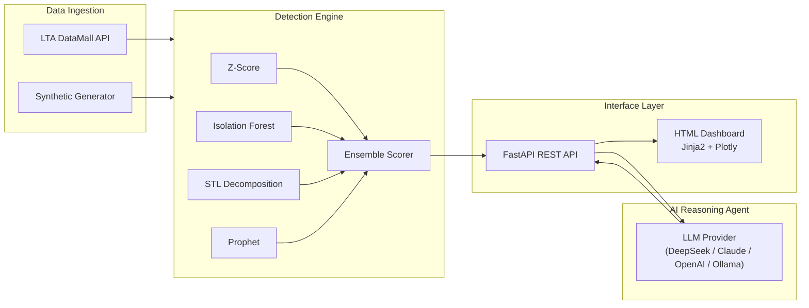

# RailSense-AI

**Real-time railway anomaly detection and AI-powered reasoning for Singapore's MRT network.**

A full-stack decision intelligence platform that ingests train sensor telemetry, applies an ensemble of statistical and ML-based anomaly detection methods, and routes flagged anomalies to an LLM-powered reasoning agent that delivers root-cause analysis, severity assessment, and actionable maintenance recommendations.

---

## Key Capabilities

| Capability | How It Works |
|---|---|
| **Time-series anomaly detection** | Four detection methods — Z-Score rolling baseline, Isolation Forest multivariate, STL seasonal decomposition, Prophet forecast residuals — combined via weighted ensemble scoring with agreement boosting |
| **Decision intelligence** | Protocol-based LLM provider abstraction (DeepSeek, Claude, OpenAI, Ollama) that analyses flagged anomalies and returns structured root-cause hypotheses, severity classifications, and maintenance recommendations |
| **Automated ML pipelines** | Prefect-orchestrated ingestion → detection → alerting workflow, Dockerised deployment, PostgreSQL persistence, 46 automated tests |
| **Data integration** | LTA DataMall API client for live train data, synthetic sensor generator with configurable failure scenarios (bearing degradation, door wear, electrical faults) |
| **Operations dashboard** | Server-rendered HTML dashboard (FastAPI + Jinja2) with 4 views: live network overview, sensor time-series drilldown with Plotly charts, severity-filtered alert feed with on-demand AI analysis, and side-by-side model comparison (precision / recall / F1) |

---

## Architecture



---

## Quick Start

```bash
# Clone and start all services
docker compose up -d

# Seed with 30-day demo dataset (5 trains, 3 failure scenarios)
docker compose exec api python -m scripts.demo_seed

# Open the dashboard
open http://localhost:8000/overview
```

---

## Detection Methods

| Method | Type | Approach | Strength |
|---|---|---|---|
| **Z-Score** | Statistical | Rolling window baseline; flags readings beyond configurable sigma thresholds | Fast, interpretable, good for sudden spikes |
| **Isolation Forest** | ML (unsupervised) | Random feature splits across 4 sensor dimensions simultaneously | Captures multivariate correlations (e.g., vibration + current draw) |
| **STL Decomposition** | Statistical | Seasonal-Trend decomposition removes daily ridership patterns; scores residuals using MAD-based robust estimation | Reduces false positives during peak hours |
| **Prophet** | Forecast-based | Generates expected value bands with daily seasonality; residuals outside forecast interval are flagged | Captures complex temporal patterns |
| **Ensemble** | Meta-method | Weighted average of all detectors with agreement boosting: anomalies confirmed by multiple methods receive elevated severity | Higher precision than any single method |

---

## AI Reasoning Agent

The agent implements a **Protocol-based provider abstraction** (`LLMProvider` protocol) enabling hot-swappable LLM backends via environment variable:

```
LLM_PROVIDER=deepseek  # or claude, openai, ollama
```

When an anomaly is flagged, the agent receives full operational context:
- Sensor type, value, and anomaly score
- Detection methods that triggered
- Peak hour status (impact assessment)
- Recent reading history (trending vs. one-off)
- Correlated sensor readings on the same train unit

It returns a structured assessment: **root cause hypothesis**, **severity classification** (critical / warning / monitor), and **recommended maintenance action** with chain-of-thought reasoning.

---

## API Endpoints

| Method | Endpoint | Description |
|---|---|---|
| `GET` | `/health` | Service health check |
| `GET` | `/api/sensors` | Query sensor readings (filter by train, type, time range) |
| `GET` | `/api/anomalies` | List detected anomaly events (filter by severity, train) |
| `POST` | `/api/assess/{id}` | Trigger AI agent assessment for a specific anomaly |
| `GET` | `/api/assessments` | List all AI agent assessments |
| `GET` | `/api/compare` | Run STL vs Prophet comparison on synthetic data |

### Dashboard Pages

| Route | View |
|---|---|
| `/overview` | Live network health overview |
| `/sensors` | Sensor time-series drilldown |
| `/alerts` | Severity-filtered alert feed |
| `/models` | Model comparison |

---

## Dashboard

Four purpose-built views designed for railway operations teams:

- **Live Overview** — Network-wide health metrics, MRT line status, and real-time anomaly feed
- **Sensor Explorer** — Drill into individual train sensor time-series with anomaly region overlays and detection method toggles
- **Alert Feed** — Severity-filtered alert cards with expandable details and on-demand AI analysis
- **Model Comparison** — Side-by-side STL vs Prophet evaluation with precision, recall, F1, computation time, and prediction overlays

---

## Tech Stack

| Layer | Technology |
|---|---|
| Language | Python 3.11 |
| API | FastAPI + Uvicorn |
| Dashboard | Jinja2 + Plotly.js (server-rendered HTML) |
| Database | PostgreSQL 16 + SQLAlchemy 2.0 |
| ML / Statistics | scikit-learn, statsmodels, Prophet |
| Orchestration | Prefect |
| LLM Providers | DeepSeek, Anthropic Claude, OpenAI, Ollama |
| Infrastructure | Docker Compose |

---

## Project Structure

```
railsense-ai/
├── docker-compose.yml
├── Dockerfile
├── pyproject.toml
├── scripts/
│   ├── seed_data.py              # Basic seed script
│   └── demo_seed.py              # 30-day demo scenario generator
├── src/
│   ├── config.py                 # Pydantic settings
│   ├── tasks.py                  # Prefect flow definitions
│   ├── api/
│   │   ├── main.py               # FastAPI application
│   │   └── schemas.py            # Pydantic response models
│   ├── agent/
│   │   ├── provider.py           # LLMProvider protocol + factory
│   │   ├── prompts.py            # System/user prompt templates
│   │   ├── deepseek_provider.py
│   │   ├── claude_provider.py
│   │   ├── openai_provider.py
│   │   └── ollama_provider.py
│   ├── dashboard/
│   │   ├── routes.py             # Dashboard page routes (Jinja2)
│   │   └── queries.py            # DB query functions for dashboard
│   ├── templates/
│   │   ├── base.html             # Shared layout (sidebar, clock)
│   │   ├── overview.html         # Live Overview page
│   │   ├── sensor_explorer.html  # Sensor Explorer page
│   │   ├── alert_feed.html       # Alert Feed page
│   │   └── model_comparison.html # Model Comparison page
│   ├── static/
│   │   └── shared-styles.css     # Design system stylesheet
│   ├── db/
│   │   ├── models.py             # SQLAlchemy models
│   │   └── session.py            # Engine + session factory
│   ├── detection/
│   │   ├── base.py               # Detector Protocol
│   │   ├── zscore.py
│   │   ├── isolation_forest.py
│   │   ├── stl_detector.py
│   │   ├── prophet_detector.py
│   │   ├── ensemble.py           # Weighted ensemble scorer
│   │   ├── compare.py            # STL vs Prophet comparison
│   │   └── pipeline.py           # Detection pipeline orchestrator
│   └── ingestion/
│       ├── lta_client.py         # LTA DataMall API client
│       └── synthetic_gen.py      # Synthetic sensor data generator
├── designs/                      # HTML/CSS dashboard mockups
└── tests/                        # 46 tests, SQLite in-memory isolation
```

---

## Testing

```bash
pytest --tb=short -q
# 46 passed
```

Full test coverage across detection methods, API endpoints, database models, LLM provider factory, data pipeline, and synthetic data generation. Tests use SQLite in-memory databases — no external services required.

---

## License

MIT
